# Project

머신러닝을 이용한 다나와 검색 단어 빈도수 예측 및 시각화 프로젝트입니다.

## 기술스택

### Python

- 데이터 파싱 및 전처리
- 데이터 분석 및 시각화
- 모델링

### Flask

- web

### Docker

- Dockerfile과 docker-compose를 통한 이미지 생성

### AWS

- EC2 인스턴스와 로드밸런싱을 통한 배포

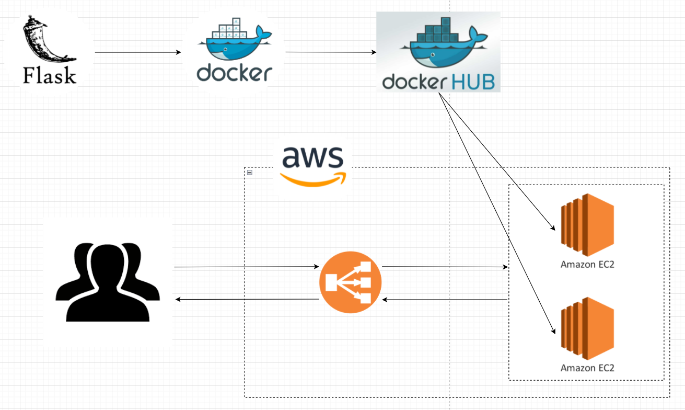

## 프로젝트 업무 흐름도

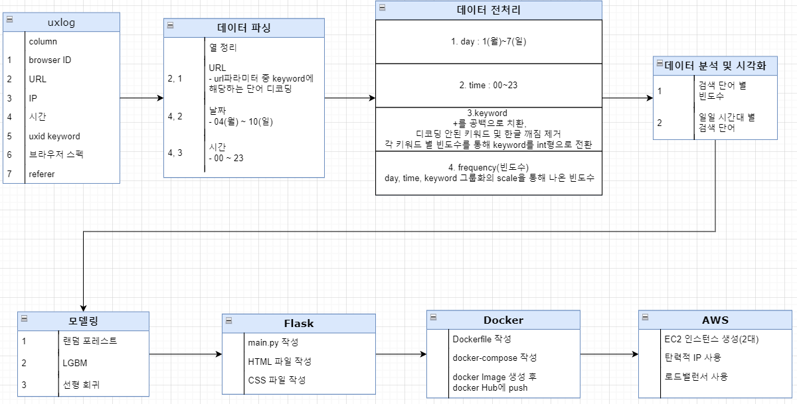

## 데이터 파싱

### uxlog 데이터

- 월요일 ~ 일요일까지의 7일간의 검색 데이터

- 파일 하나당 7개의 컬럼으로 분류하여 가져옴
  - Bid(browser ID)
  - Uxid keyword 파라미터
  - spec(브라우저 스펙)
- 파일 하나를 파싱한 데이터프레임 정보

### parsing

- 검색단어, 요일, 시간의 3개의 column을 가진 데이터프레임을 csv파일로 저장
  - 검색단어 : URL에서 keyword에 해당하는 부분
  - 요일 : Time에서 일자에 해당하는 부분
  - 시간 : Time에서 시간에 해당하는 부분
  - 약 750만개 정도의 데이터 프레임이 생성되었음.

## 데이터 분석

- 요일별 검색 빈도수
  - 큰 차이 없음

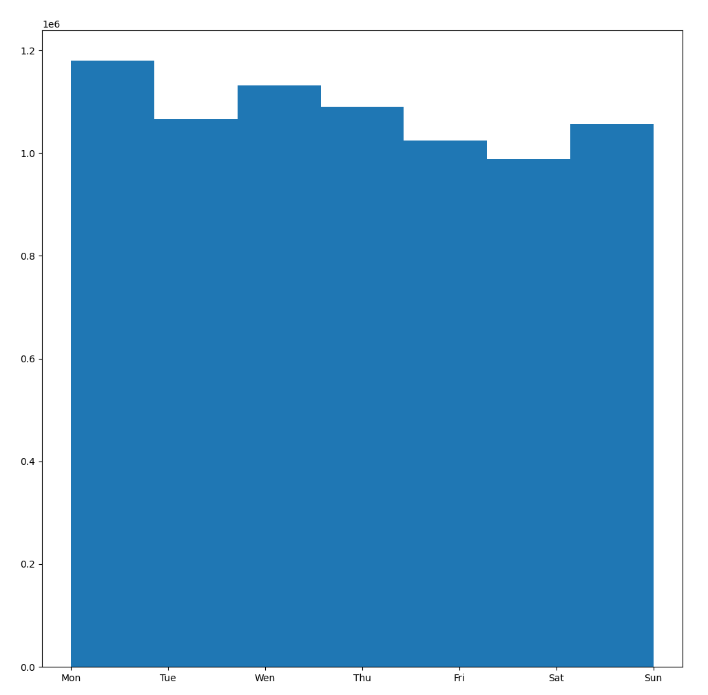

- 빈도수가 높은 순의 키워드 100개 추출
  - bitway와 buyus의 키워드가 압도적으로 많습니다.
  - 상위 3개의 단어를 제외하면 2700번의 빈도수 ~ 20000번의 빈도수까지 다양합니다.

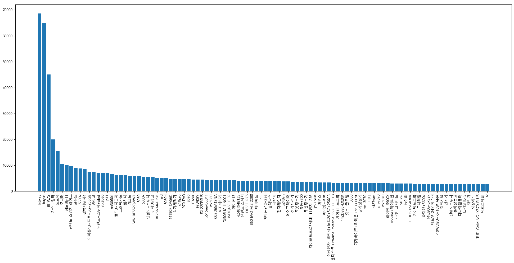

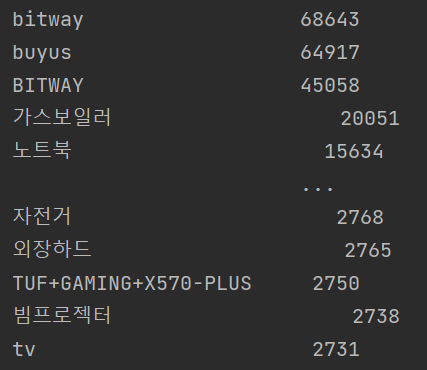

- 빈도수 상위 12개의 단어 시간대 별 그래프
  - 비슷한 성향의 그래프도 있는 반면 단어마다 시간대 별 검색 빈도수 추이가 다른 것을 볼 수 있습니다.

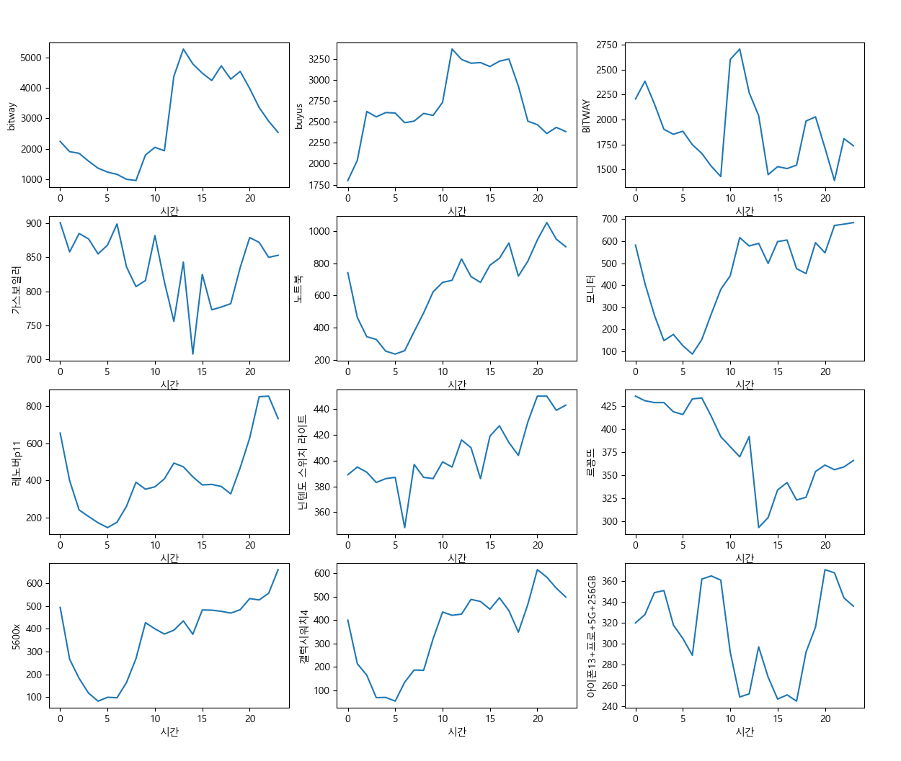

- 요일별로 나타낸 시간대 별 검색 빈도수(그래프와 데이터)

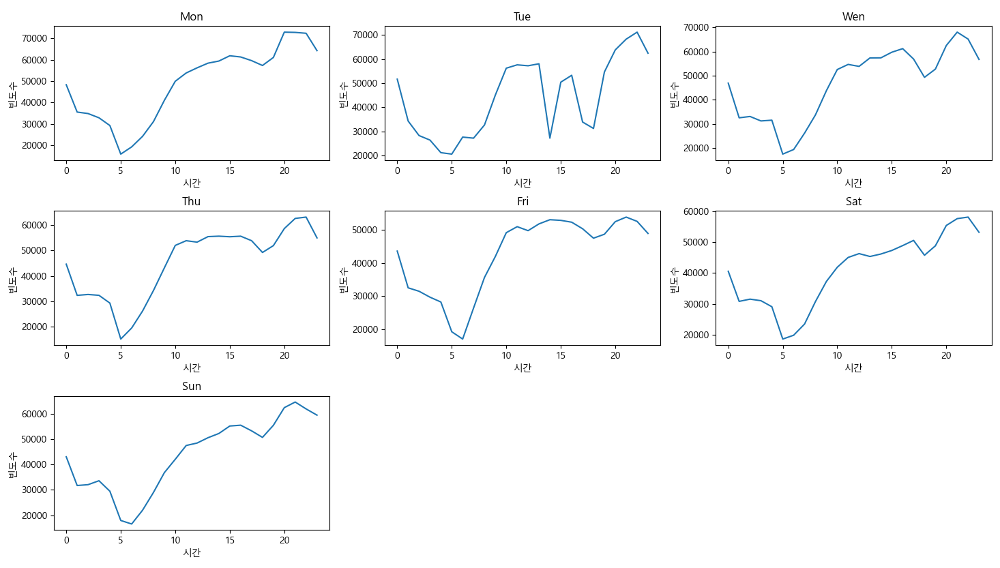

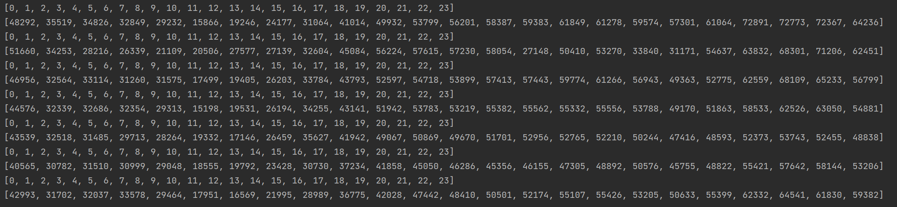

## 데이터 전처리

1. 전체 구상 컬럼
   - keyword : 검색 단어
   - time : 시간대(0~23)
   - day : 요일(1~7)
   - frequency : 빈도수
   
2. 파싱된 데이터 : keyword, day, time

3. 결측치 제거

4. 디코딩 안된 키워드 및 한글 깨짐 제거

5. keyword의 +를 공백으로 변환

6. day, time, keyword 그룹화의 scale을 통해 나온 빈도수로 frequency컬럼 생성

7. keyword 정수인코딩

   - 각 keyword 별 빈도수를 통해 keyword를 int형으로 전환

   - keyword의 숫자가 높을 수록 빈도수가 많은 상관관계를 부여하기 위함

8. 지도 학습을 위해 학습 데이터와 테스트 데이터로 데이터 분리

- 약 230만개 정도의 데이터

## 데이터 학습 모델

> 평가는 MSE를 이용하여 측정
>
> 분산 기반 평가모델인 r2_score(1에 가까울 수록 높은 값)또한 참고

### 손실함수 및 사용 모델

- 손실함수
  - MSE(평균제곱오차)
    - 회귀 모델의의 손실 함수중 하나
    - (실제값 - 예측값)^2의 평균

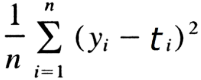

1. 랜덤 포레스트 회귀 모델
   - MSE : 26.90780414391341
   - r2_score : 0.598
2. XGBRF 회귀모델
   - MSE : 28.695077866284603
   - r2_score : 0.607
3. 히스토그램기반 그레디언트 부스팅 회귀모델
   - MSE : 80.20073241459797
   - r2_score : -0.17
4. LGBM 회귀모델
   - MSE : 79.35698858970437
   - r2_score : -0.158
5. 선형회귀모델
   - MSE : 18.026728389325097
   - r2_score : 0.737
   - 전처리 과정에서 선형적 상관관계를 부여해서 MSE가 낮게 나온것으로 추측

### 최종 모델

- 히스토그램기반 그레디언트 부스팅과 LGBM회귀모델은 학습이 제대로 되지 않는 것으로 판단
- (랜덤 포레스트 회귀모델 + XGBRF회귀모델 + 선형회귀모델) / 3 의 방식을 채택
- python의 pickle 모듈을 이용하여 해당 모델들의 pickle파일 생성

## Flask

- 메인 페이지

- 예측할 데이터 입력 페이지

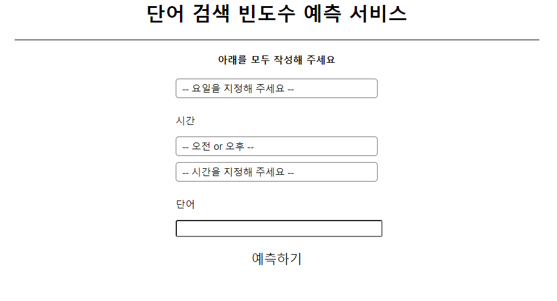

- 예측 결과 페이지

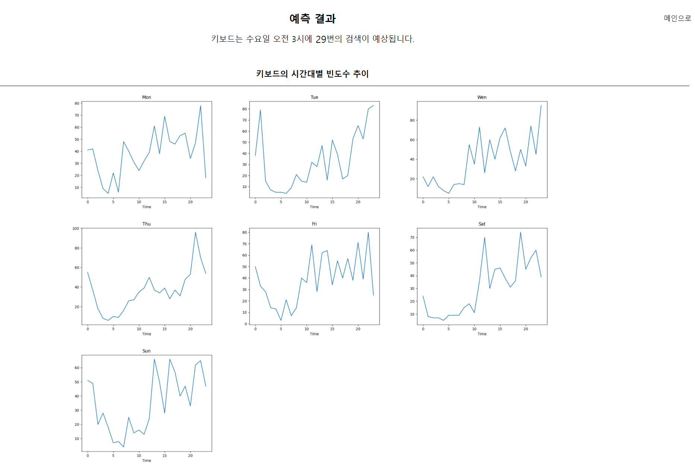

## 피드백

- 미숙한 전처리

  - 통합되지 않은 텍스트 전처리(대문자, 소문자)

  - 빈도수 처리 관련(매우 작은 빈도수를 보이는 단어를 학습에서 제외하지 않았음)

- 코드 추상화 경험 필요

  - 초반의 절차적인 코딩 형식으로 인해 클래스, 함수를 이용한 추상화 과정에도 시간이 소요됨.
  - 초기에 코딩 당시 객체지향적 프로그래밍 계획을 세우고 하는 것이 필요

- AWS 볼륨 이슈
  - AWS 로드밸런스와 인스턴스 2개를 이용하여 예측결과 페이지에서 그래프를 보여줄 때 EC2-1과 EC2-2의 볼륨이 달라서 그래프가 출력되지 않는 경우가 발생
  - AWS 미숙으로 인해 파이썬 코드수정으로 해결. 
  - 추후 AWS를 이용한 해결방안 모색 필요

- 머신러닝 모델
  - 하이퍼 파라미터 제어

